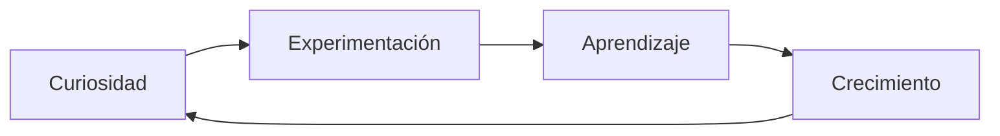

<div align="center">
  

```ascii
╭──────────────────────────────────────╮
│     > Hello World! Soy Jorge <       │
│   Estudiante & Tech Enthusiast       │
╰──────────────────────────────────────╯
```

</div>

<div align="center">
  
[](https://git.io/typing-svg)

</div>

## 👨‍💻 Sobre Mí

```python
class Jorge:
    def __init__(self):
        self.sobre_mi = {
            "tipo": "Estudiante de Informática",
            "pasiones": ["Tecnología", "Gaming", "Anime"],
            "personalidad": ["Tranquilo", "Serio", "Reflexivo"],
            "próximamente": "FP de Informática",
            "sueño_actual": "Tener un perro 🐕"
        }
        
    def intereses_tech(self):
        return [
            "🐳 Docker",
            "🎮 Servidores de Minecraft",
            "⌨️ Terminal",
            "🔧 Sistemas"
        ]
    
    def universos_favoritos(self):
        return [
            "⭐ Star Wars",
            "🎌 Anime",
            "🐉 Pokémon"
        ]
```

## 🚀 Mi Viaje Tech

<div align="center">



</div>

## 🛠️ Tecnologías que Exploro

<div align="center">


</div>

## 🎮 Gaming & Entretenimiento

<table align="center">
  <tr>
    <td align="center" width="100">
      
      <br>Gaming
    </td>
    <td align="center" width="100">
      
      <br>Star Wars
    </td>
    <td align="center" width="100">
      
      <br>Anime
    </td>
    <td align="center" width="100">
      
      <br>Pokémon
    </td>
  </tr>
</table>

## 📚 Actualmente Aprendiendo

- 📘 Fundamentos de Programación
- 🐳 Containerización con Docker
- 🖥️ Administración de Servidores
- 🎮 Desarrollo de Servidores de Minecraft

## 💭 Pensamientos

> *"La tecnología es más divertida cuando experimentas y aprendes por tu cuenta"*

## 🌟 Objetivos Próximos

```txt
📚 Comenzar mi FP de Informática
🐕 Adoptar un compañero canino
🎮 Crear mi propio servidor de Minecraft
💻 Desarrollar proyectos personales
```

## 🎯 Fun Facts

- 🐕 Próximamente: ¡Dueño de un perro!
- 🎮 Jugador desde siempre
- 🌟 Fan de Star Wars
- 📺 Otaku de corazón
- 🤔 Persona reflexiva
- 💡 Aprendiz autodidacta

---

<div align="center">
  
  <br>
  <sub>A la espera de mi futuro compañero de aventuras 🐾</sub>
  
  <br>
  <br>
  
  
  
</div>
